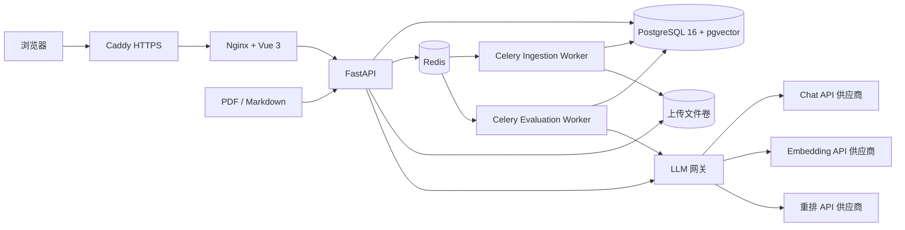

# DocMind

## 简介

DocMind 是一个面向企业知识库的 RAG 问答系统，覆盖文档上传、解析切片、向量化、
混合检索、重排、引用可校验生成、会话持久化、成本追踪和离线评测。

项目采用前后端分离的 monorepo。浏览器请求统一进入 Nginx/Caddy，前端静态资源由
Nginx 托管，`/api` 同源反向代理到 FastAPI；文档解析由 Celery 异步执行。模型调用
默认使用 OpenAI 兼容接口，目前可切换 DeepSeek、Qwen/GLM 等兼容供应商。

## 架构图



## 快速开始

### Docker 一键启动

要求 Docker Engine 24+ 与 Docker Compose v2。

```bash
cp .env.example .env
cp backend/.env.example backend/.env
```

编辑 `backend/.env`，至少填写当前模型路由实际使用的密钥：

```dotenv
DEEPSEEK_API_KEY=
DASHSCOPE_API_KEY=
```

默认的 `RERANK_PROVIDER=llm` 复用聊天模型密钥。只有切换到独立 bge 重排服务时，
才需要额外配置 `RERANK_API_KEY`。

构建并启动 PostgreSQL、Redis、API、文档解析 Worker、评测 Worker 和前端：

```bash
docker compose --profile app up -d --build --wait
docker compose --profile app ps
```

默认地址：

- 前端：`http://127.0.0.1:15173`
- 前端健康检查：`http://127.0.0.1:15173/healthz`
- API 与模型网关状态：`http://127.0.0.1:15173/api/health`
- PostgreSQL：`127.0.0.1:15432`
- Redis：`127.0.0.1:16379`

PostgreSQL、Redis 和前端默认只绑定本机回环地址。Compose 会在启动 API 前自动执行
Alembic 迁移，并通过健康检查等待依赖服务。

停止服务：

```bash
docker compose --profile app down
```

删除数据卷并重新初始化：

```bash
docker compose --profile app down -v
```

### 本地开发

Windows PowerShell：

```powershell
.\scripts\dev.ps1
```

开发模式只通过 Docker 启动 PostgreSQL 和 Redis，FastAPI、Celery 与 Vite 在宿主机
运行。完整检查可执行：

```powershell
.\scripts\verify.ps1
```

## 核心设计

### 结构感知切片

PDF 由 PyMuPDF 按页提取，Markdown 按 ATX 标题解析。切片器优先保留 Markdown 标题
层级、页码和 `heading_path`；PDF 当前保留页码，但不会自动推断字体标题层级。只有
超过配置上限的块才使用 `RecursiveCharacterTextSplitter` 兜底。

- 叶子块默认 `CHUNK_SIZE=512`、`CHUNK_OVERLAP=64`。
- `PARENT_CHILD_ENABLED=true` 时额外生成约 2048 字符的父块，检索叶子块后回传父块，
  兼顾召回精度与生成上下文完整性。
- PDF 表格页会转换为 Markdown；`OCR_ENABLED=true` 时，仅对完全无法提取文本的页面
  启用 Tesseract OCR。包含页码水印但正文为图片的页面仍需后续增加文本密度判断。
- 所有切片保存 `document_id`、`page_number`、`heading_path`、`parent_chunk_id`，
  因而可以稳定追溯引用来源。

### 混合检索

- 向量检索使用 PostgreSQL `pgvector`，1024 维 embedding，HNSW 索引，
  距离算子为余弦距离 `<=>`。
- BM25 使用 jieba 中文分词和自建倒排表 `chunk_terms`，默认参数 `k1=1.5`、
  `b=0.75`，公式与出处见 `backend/app/retrieval/README.md`。
- 两路结果通过 RRF 融合：`score(d) = sum(1 / (k + rank(d)))`，默认 `k=60`。
- `/api/v1/search` 支持 `mode=vector|bm25|hybrid`，便于做离线对比和线上消融实验。
- 重排默认走同一 LLM 网关的 JSON 打分实现；`RERANK_PROVIDER` 可切换
  `llm`、`passthrough`，bge 兼容服务的接入点也已保留。

### 引用校验

生成 Prompt 位于 `backend/app/rag/prompts/rag_answer.j2`，要求模型返回：

```json
{"answer": "带 [1] 引用的答案", "citations": [1]}
```

流式解析器先读取并校验 `citations`，再逐段发送 `answer`。所有引用编号必须位于本次
检索片段范围 `1..N` 内；格式错误、空答案或越界引用会触发一次自动重试。

完整回答生成后还会执行逐句引用语义校验，判断每句话是否真的被引用片段支持。非流式
生成语义校验失败会重新生成一次；流式生成时回答可能已经逐步展示，但校验失败不会发送
`DoneEvent`，也不会写入缓存或会话消息。

### 拒答

重排后若结果为空，或 top1 分数低于有效拒答阈值，系统直接返回 `未找到相关资料`，
不会调用生成模型。运行时优先读取按 `mode + top_k + reranker` 校准并持久化的阈值；
没有校准记录时才回退 `RAG_REFUSAL_THRESHOLD`。阈值应使用评测集校准，而不是凭经验
固定。

### 其他上线能力

- 每次问答生成 `trace_id`，记录 rewrite、retrieve、rerank、generate 各阶段耗时和 token。
- Redis 缓存键包含问题、知识库 revision 和检索配置；缓存命中在 SSE 中标记 `cached=true`。
- Redis 令牌桶按已验证的 API Key/会话指纹限流；匿名请求按可信代理后的客户端 IP
  限流，超额返回 `429` 和 `Retry-After`。
- 评测任务投递到独立 `evaluation` 队列，API 立即返回 `202` 和 `run_id`，前端轮询进度；
  长时间评测不会阻塞文档解析 `ingestion` 队列。
- 评测支持取消和失败续跑；每个完成样本写入 checkpoint，恢复时不会重复执行已完成样本。
- 每次评测自动冻结数据集 revision、完整样本快照和知识库 revision，后续编辑不会改变历史运行。
- 生成结果会再经过逐句引用语义校验；无证据支持的答案不会完成持久化或进入缓存。
- 可通过评测集校准各 `mode + top_k + reranker` 组合的拒答阈值，运行时优先使用校准值。
- 请求日志为结构化 JSON，响应包含 `X-Request-ID`；调试页可按 `trace_id` 回放。
- `REQUIRE_API_KEY=true` 后，API 客户端携带 `X-API-Key`，浏览器通过登录页换取
  HttpOnly 会话 Cookie。

## 评测结果

以下数据必须来自同一固定数据集和固定模型配置。当前保留为空，待人工校准正式评测集后填写。

生成待审核评测数据：

```bash
uv run --project backend python scripts/gen_eval_data.py generate \
  --dataset-name docmind-v1 --count 40
```

`dataset-name` 是自定义的数据集版本名，不需要提前创建。默认使用所有 ready 文档；
只指定部分文档时，重复传入 `--document-name`：

```bash
uv run --project backend python scripts/gen_eval_data.py generate \
  --dataset-name software-copyright-v1 --count 40 \
  --document-name "软件架构设计与代码质量评估系统.pdf" \
  --document-name "软件架构设计与代码质量评估系统-代码java.pdf"
```

人工检查 `scripts/eval_data/docmind-v1.jsonl`，将确认样本的 `review_status` 改为
`approved`，再导入数据库。脚本不会在生成阶段自动写库，导入时只接受 `approved`
记录，并校验 expected chunk 必须是 ready 文档中的叶子块：

```bash
uv run --project backend python scripts/gen_eval_data.py import \
  --input scripts/eval_data/docmind-v1.jsonl
```

| 检索配置 | Recall@5 | MRR | 忠实度 1-5 | 答案相关性 1-5 | RAGAS 忠实度 | RAGAS 相关性 | 平均首字延迟 ms | 平均成本 | 拒答率 |
| --- | --- | --- | --- | --- | --- | --- | --- | --- | --- |
| 纯向量 | | | | | | | | | |
| 纯 BM25 | | | | | | | | | |
| 混合检索 | | | | | | | | | |
| 混合检索 + 重排 | | | | | | | | | |

评测数据应记录数据集版本、文档 revision、模型名、Prompt 版本、运行时间与样本数。
不能只保留最终均值，否则后续无法解释指标变化。

## 云主机部署（含 HTTPS）

以下清单适用于 Ubuntu 22.04/24.04 或兼容发行版的 2C4G 云主机。若使用其他系统，
只替换安装 Docker 的命令，其余步骤不变。

### 1. 准备域名和防火墙

1. 为应用准备一个域名，例如 `docmind.example.com`，添加 A/AAAA 记录指向云主机公网 IP。
2. 安全组和主机防火墙只开放 `22`、`80`、`443`。不要向公网开放 PostgreSQL 端口 `5432` 或 Redis 端口 `6379`。
3. 2C4G 主机建议配置至少 2 GB swap，避免镜像构建和模型响应并发时触发 OOM。

### 2. 安装 Docker

```bash
curl -fsSL https://get.docker.com | sudo sh
sudo usermod -aG docker "$USER"
newgrp docker
docker compose version
```

### 3. 拉取代码并创建配置

```bash
git clone <YOUR_REPOSITORY_URL> docmind
cd docmind
cp .env.example .env
cp backend/.env.example backend/.env
```

编辑根目录 `.env`：

```dotenv
POSTGRES_PASSWORD=<使用 URL-safe 随机强密码>
DOMAIN=docmind.example.com
BIND_ADDRESS=127.0.0.1
VITE_API_BASE_URL=
CADDY_HTTP_PORT=80
CADDY_HTTPS_PORT=443
```

密码会直接拼入容器内数据库 URL，正式环境使用只含字母、数字、下划线和连字符的
随机值，避免 `@`、`:`、`/` 等字符导致连接串解析失败。

编辑 `backend/.env`：

```dotenv
APP_ENV=production
LOG_LEVEL=INFO
CORS_ORIGINS=https://docmind.example.com
REQUIRE_API_KEY=true
API_KEYS=<随机生成的访问密钥>
SESSION_SECRET_KEY=<至少 32 字符的随机签名密钥>
TRUST_PROXY_HEADERS=true
DEEPSEEK_API_KEY=<供应商密钥>
DASHSCOPE_API_KEY=<供应商密钥>
RERANK_PROVIDER=llm
```

根目录 `.env` 和 `backend/.env` 已被 Git 忽略。不要把真实密钥写入
`.env.example`、代码、镜像或 CI 日志。

浏览器访问时会跳转到登录页。用户输入 `API_KEYS` 中的访问密钥后，后端签发
HttpOnly、SameSite=Strict 的签名会话 Cookie，原始密钥不会写入浏览器的
`localStorage`。`TRUST_PROXY_HEADERS=true` 只能在后端不直接暴露公网、
请求必须经过 Caddy/Nginx 时使用。

### 4. 启动全栈和 HTTPS

Caddy 使用 `DOMAIN` 自动申请并续期 Let's Encrypt 证书，同时把 HTTP 重定向到 HTTPS。

```bash
docker compose --profile app --profile tls up -d --build --wait
docker compose --profile app --profile tls ps
docker compose logs -f --tail=100 caddy backend worker eval-worker
```

验证：

```bash
curl -fsS https://docmind.example.com/healthz
curl -fsS https://docmind.example.com/api/health
curl -fsS -H "X-API-Key: <接口密钥>" \
  "https://docmind.example.com/api/v1/search?q=测试&mode=hybrid"
```

首次签发证书要求域名已经解析、80/443 可从公网访问，且 DNS 没有错误代理。Caddy
证书保存在 `caddy_data` 卷，容器重建不会重复申请。

### 5. 更新、日志与备份

更新代码和镜像：

```bash
git pull --ff-only
docker compose --profile app --profile tls up -d --build --wait
docker compose ps
```

查看服务状态和日志：

```bash
docker compose --profile app --profile tls ps
docker compose logs -f --tail=200 backend worker eval-worker frontend caddy
```

每天备份 PostgreSQL：

```bash
docker compose exec -T postgres \
  pg_dump -U docmind -d docmind -Fc > "docmind-$(date +%F).dump"
```

上传文件位于 `upload_data` 卷，生产环境应定期备份该卷，并把数据库与文件备份保存到
另一台机器或对象存储。恢复前先停止 API 和 Worker，避免写入与恢复并发。

## 已知问题与 TODO

- `models.toml` 中部分模型价格仍为占位值，正式展示成本前必须按供应商当前价格更新。
- OCR 默认关闭，需要宿主机安装 Tesseract 及中文语言包；复杂表格、公式和扫描件仍需
  人工抽样验收。
- RAGAS 适配层直接使用 OpenAI 兼容客户端，尚未完全收口到 `app/llm/` 网关，这是当前
  架构一致性缺口。
- 向量维度固定为 1024。切换不同维度的 embedding 模型前必须新增 Alembic 迁移并重建
  全部向量。
- 当前是单机 Compose 部署，没有 PostgreSQL/Redis 高可用、自动故障转移和跨可用区容灾。
- API 鉴权只有静态 API Key，没有用户、角色、文档级 ACL 或租户隔离。
- 上传文件使用 Docker named volume，不是对象存储；大文件和多实例部署需要迁移到 S3
  兼容存储。
- 还没有自动化备份恢复演练、依赖漏洞扫描、告警规则和容量压测报告。
